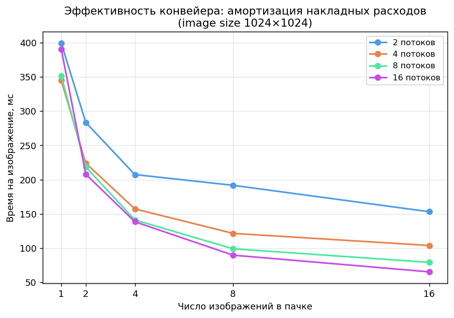
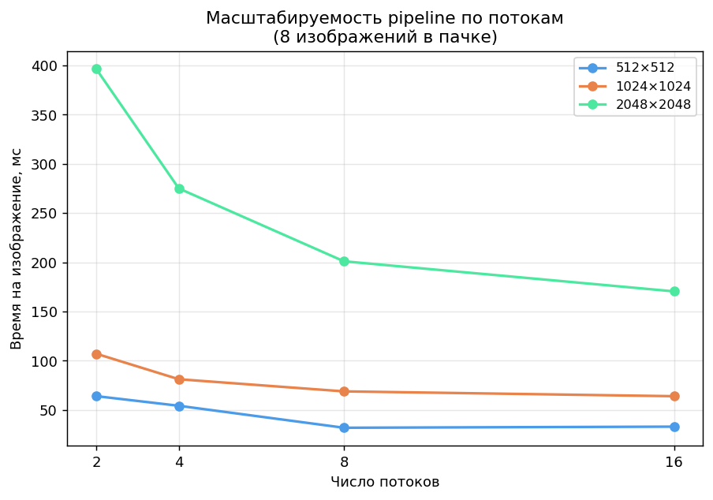
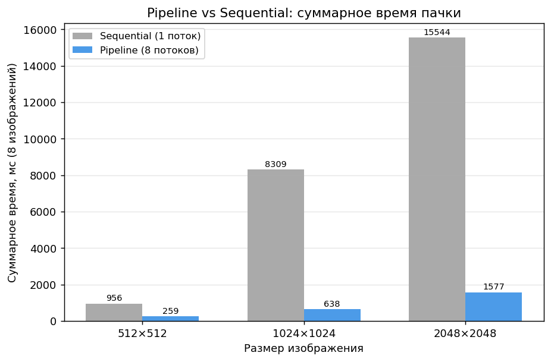

# Анализ производительности свёртки

Бенчмарк запущен с помощью **kotlinx.benchmark** (JMH).
Число потоков: 2, 4, 8, 16.
Размеры изображений: 512, 1024, 2048.

## Размер изображения 512x512

**Последовательная реализация:** 22 ± 2 мс

### Параллельные методы при 16 потоках

| Метод | Время, мс | ±95% CI | Ускорение |
|---|---|---|---|
| ROW_BY_ROW | 5 | 1 | 4.63× |
| COLUMN_BY_COLUMN | 5 | 2 | 4.09× |
| GRID | 5 | 1 | 4.07× |
| PIXEL_BY_PIXEL | 6 | 2 | 3.87× |

## Размер изображения 1024x1024

**Последовательная реализация:** 82 ± 5 мс

### Параллельные методы при 16 потоках

| Метод | Время, мс | ±95% CI | Ускорение |
|---|---|---|---|
| ROW_BY_ROW | 16 | 3 | 4.96× |
| COLUMN_BY_COLUMN | 16 | 4 | 5.15× |
| GRID | 16 | 3 | 5.21× |
| PIXEL_BY_PIXEL | 17 | 3 | 4.81× |

## Размер изображения 2048x2048

**Последовательная реализация:** 329 ± 13 мс

### Параллельные методы при 16 потоках

| Метод | Время, мс | ±95% CI | Ускорение |
|---|---|---|---|
| ROW_BY_ROW | 53 | 4 | 6.21× |
| COLUMN_BY_COLUMN | 53 | 4 | 6.24× |
| GRID | 52 | 5 | 6.35× |
| PIXEL_BY_PIXEL | 54 | 4 | 6.12× |

---
## Наблюдения
### Эффективность и масштабируемость
*   **Зависимость от размера**: С ростом разрешения ускорение увеличивается (от ~4× до ~6×), так как полезные вычисления начинают превалировать над затратами на управление потоками.
*   **Лимит потоков**: Рост производительности затухает после 8–16 потоков. Это указывает на то, что узким местом становится пропускная способность памяти (Memory Wall), а не мощность процессора.

---

## Pipeline

Конвейер разделяет чтение, свёртку и запись на три независимые стадии, что позволяет перекрывать IO и вычисления.

### Суммарное время пачки из 8 изображений

| Размер | Sequential (1 поток), мс | Pipeline (8 потоков), мс | Ускорение |
|--------|--------------------------|--------------------------|-----------|
| 512×512 | 956 | 259 | 3.69× |
| 1024×1024 | 8309 | 638 | 13.03× |
| 2048×2048 | 15544 | 1577 | 9.86× |

С ростом числа изображений в пачке время на одно изображение снижается: накладные расходы на старт конвейера амортизируются.

Увеличение числа потоков ускоряет обработку — особенно заметно на крупных изображениях, где свёртка доминирует над IO.

### Наблюдения

**Амортизация накладных расходов.** При обработке одного изображения время на него составляет ~400 мс (1024×1024, любое число потоков) — это накладные расходы на старт конвейера и JVM. При росте пачки до 16 изображений оно снижается до 65–155 мс в зависимости от числа потоков. Конвейер выгоден только при обработке нескольких изображений подряд.

**Масштабируемость по потокам.** Для крупных изображений (2048×2048) переход с 2 до 8 потоков даёт почти двукратное снижение времени на изображение (397 → 201 мс). Для 512×512 прирост от 8 до 16 потоков практически отсутствует (33 → 35 мс): изображение слишком мало, чтобы занять все потоки, и накладные расходы на координацию начинают превалировать.

**Pipeline vs Sequential.** На пачке из 8 изображений pipeline с 8 потоками быстрее однопоточного в 3.7–13× в зависимости от размера. Аномально высокое ускорение для 1024×1024 (13×) объясняется тем, что JVM успевает прогреться на предыдущих запусках, а этот размер хорошо помещается в кэш процессора — свёртка выполняется особенно эффективно. Для 2048×2048 ускорение ниже (9.9×): изображение давит на пропускную способность памяти, и добавление потоков перестаёт помогать так же эффективно — что согласуется с наблюдениями из параллельного бенчмарка.