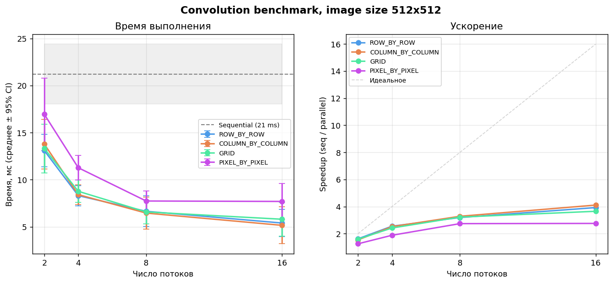
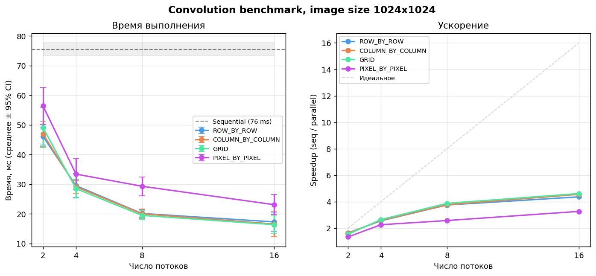
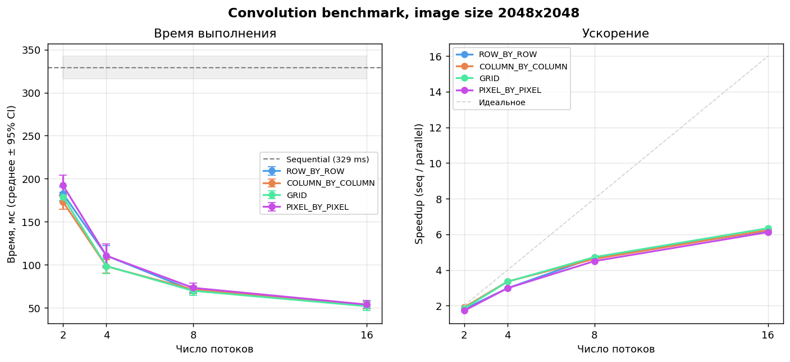

# Анализ производительности свёртки

Бенчмарк запущен с помощью **kotlinx.benchmark** (JMH).
Число потоков: 2, 4, 8, 16.
Размеры изображений: 512, 1024, 2048.

## Размер изображения 512x512

**Последовательная реализация:** 21 ± 3 мс

### Параллельные методы при 16 потоках

| Метод | Время, мс | ±95% CI | Ускорение |
|---|---|---|---|
| ROW_BY_ROW | 5 | 1 | 3.92× |
| COLUMN_BY_COLUMN | 5 | 2 | 4.11× |
| GRID | 6 | 2 | 3.65× |
| PIXEL_BY_PIXEL | 8 | 2 | 2.76× |

## Размер изображения 1024x1024

**Последовательная реализация:** 76 ± 2 мс

### Параллельные методы при 16 потоках

| Метод | Время, мс | ±95% CI | Ускорение |
|---|---|---|---|
| ROW_BY_ROW | 17 | 3 | 4.37× |
| COLUMN_BY_COLUMN | 17 | 4 | 4.56× |
| GRID | 16 | 3 | 4.61× |
| PIXEL_BY_PIXEL | 23 | 3 | 3.27× |

## Размер изображения 2048x2048

**Последовательная реализация:** 312 ± 12 мс

### Параллельные методы при 16 потоках

| Метод | Время, мс | ±95% CI | Ускорение |
|---|---|---|---|
| ROW_BY_ROW | 52 | 3 | 6.04× |
| COLUMN_BY_COLUMN | 54 | 7 | 5.82× |
| GRID | 71 | 8 | 4.38× |
| PIXEL_BY_PIXEL | 54 | 4 | 5.82× |

---
## Наблюдения

### Сравнение стратегий
*   **Лидеры**: `ROW_BY_ROW` и `COLUMN_BY_COLUMN` стабильно эффективны на всех размерах изображений.
*   **GRID**: Демонстрирует стабильность, но на максимальном разрешении (2048x2048) заметно уступает строчно-столбцовым методам.

### Эффективность и масштабируемость
*   **Зависимость от размера**: С ростом разрешения ускорение увеличивается (от ~4× до ~6×), так как полезные вычисления начинают превалировать над затратами на управление потоками.
*   **Лимит потоков**: Рост производительности затухает после 8–16 потоков. Это указывает на то, что узким местом становится пропускная способность памяти (Memory Wall), а не мощность процессора.

### Итоговый вывод
Для задач свёртки оптимально использовать **построчное** или **постолбцовое** распределение. Метод **GRID** не дает преимуществ.